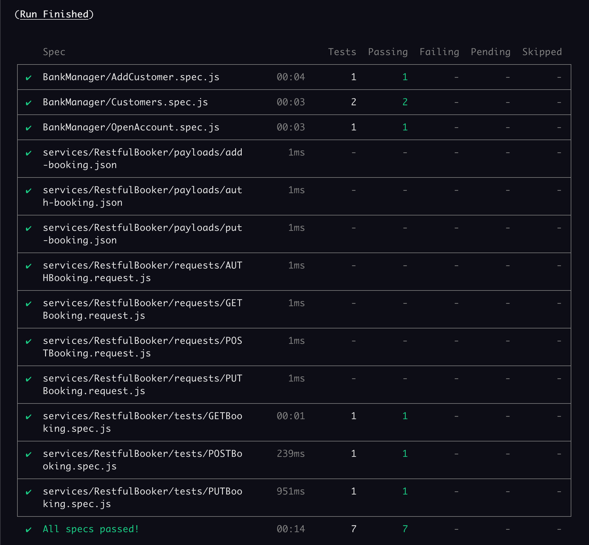

### Banking Project E2E Tests


## Project Setup

```shell
$ npm install
```

```shell
npm install --save-dev cypress @testing-library/cypress
```

### Running the E2E Tests

**Open Cypress in the interaction mode:**

```shell
$ npm run cy:open
```

**To execute tests in headless mode:**

```shell
$ npm run cy:run
```

This will run all tests in headless mode by default.

### Structure

The tests are inside the `integration` directory grouped by what they represent.

```javascript
│   ├── integration
│       │ └── BankManager
│       │   └── AddCustomer.spec.js
│       │   └── Customers.spec.js
│       │   └── OpenAccount.spec.js
│       └── Services
│           └── RestfulBooker
│           └── payloads
│           └── requests
│           └── tests
│             └── GETBookings.spec.js
│             └── POSTBooking.spec.js
│             └── PUTBooking.spec.js
```

#### Page Objects

[Page Objects](https://martinfowler.com/bliki/PageObject.html) are located in the `pages` directory.

```javascript
│   ├── pages
│       ├── AddCustomerPage.js
│       ├── CustomerPage.js
│       ├── HomePage.js
│       ├── OpenAccountPage.js
```


